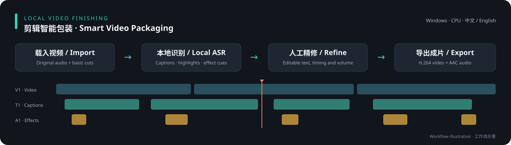

<div align="center">

# 剪辑智能包装

**把类似剪映「智能包装」的字幕、高亮词和音效流程，放到本地电脑上运行。**

Local video finishing inspired by Jianying / CapCut: speech-to-subtitles, keyword highlights, sound effects, and an editable timeline.

[中文](README.md) · [English](README.en.md) · [识别要求与模型](docs/recognition.md) · [安装检查](#安装与启动) · [MIT License](LICENSE)



</div>

剪辑智能包装是一款 **Windows 本地桌面视频工具**，适合商品讲解、直播切片、口播和教程视频。先用本地模型生成字幕、提取重点词，再根据内容安排音效；你可以直接在时间轴上修正文案、拖动片段、调整字体与音量，最后导出视频。

**完成首次依赖和模型下载后，语音识别、文案分析、预览与导出均在本机完成，不需要云端 ASR / LLM API Key。** 素材、工程、识别缓存和人工修订快照保存在本地。

本项目是独立开源实现，与剪映 / CapCut 及其所属公司没有隶属关系；不包含其私有模型、模板或音效资源。这里的“智能包装”指自动字幕、重点词高亮与音效编排工作流。

## 能做什么

| 功能 | 当前实现 |
| --- | --- |
| 本地字幕识别 | SenseVoice INT8 + VAD；薄弱语音段局部重试，并以 faster-whisper base INT8 补识别 |
| 字幕与重点词 | 从视频文件名提取产品提示；Qwen3.5-0.8B 做文案分析，修改文字时保留时间轴 |
| 音效包装 | 内置 29 种 CC0 音效；结合文案分析与规则推荐位置，可试听、拖动、拉长和调音量 |
| 多轨时间轴 | V1 视频、T1 字幕、A1 音效；字幕和音效都支持右键删除 |
| 基础剪辑 | 单个源视频分割、裁剪、删除后自动接合；字幕和音效联动前移，支持撤销 / 重做 |
| 人工精修 | 可选本机字体、字号、颜色、字幕位置；编辑文字、起止时间和高亮词 |
| 批量处理 | 按文件顺序进行识别与包装分析，保存工程，汇总通过 / 需回听 / 失败；可逐个复核并导出 |
| 本地成片 | FFmpeg 输出 H.264 / AAC，保留原视频声音并混入音效 |
| 双语界面 | 中文 / English 即时切换；界面语言与视频原声语言独立 |

音效总音量默认 **50%**，单段可在 **0–200%** 间调节。默认数量：60–75 秒约 10 个、超过 75–100 秒约 12 个、超过 100–120 秒约 14 个；更长视频按每分钟 7 个估算，例如 30 分钟目标 210 个。少于 60 秒按每 6 秒 1 个估算。优先保留合适的位置，位置不足时少放。

## 使用流程

1. 载入一个视频，选择原声语言，或使用“自动识别”。
2. 可先在 V1 时间轴做简单分割、裁剪和删除。
3. 点击“智能包装”，生成字幕、重点词和音效建议；也可以选择文件夹批量分析。
4. 回听被标记的语音区间，修正品牌名称、字幕边界、高亮词与音效音量。
5. 保存工程，点击“导出”，得到带字幕和音效的视频。

**识别要求：** 输入视频需要包含可听清的人声；建议单人讲话、背景音乐不要盖过原声，产品名称尽量写入文件名。此功能识别音轨中的语言；画面字幕 OCR、自动翻译不属于当前流程。详细参数见[中英文识别说明](docs/recognition.md)。

## 安装与启动

当前交付为源码版，可自行构建桌面 EXE。建议把整个目录放在空间充足的磁盘。

### 运行要求

| 项目 | 要求 |
| --- | --- |
| 系统 | Windows 10 / 11 x64 |
| Python | 推荐 Python 3.12 x64，当前依赖范围为 3.10–3.12；安装时勾选加入 PATH |
| 视频工具 | [FFmpeg 和 ffprobe](https://ffmpeg.org/download.html) 加入 PATH；FFmpeg 需支持 libx264、AAC 和 ASS / libass |
| 桌面组件 | .NET Framework 4.8、[Microsoft WebView2 Runtime](https://developer.microsoft.com/microsoft-edge/webview2/) |
| 内存 | 推荐 8GB 或以上；采用面向低内存设备的顺序 CPU 推理策略，4GB 设备可尝试并需保留系统分页文件，但尚未完成真实 4GB 硬限制压力测试 |
| GPU | 不要求独立显卡；所下载的 llama.cpp CPU 构建需要与处理器指令集兼容 |
| 磁盘 | 模型约 1GB，另需 Python 依赖和运行组件；建议预留至少 5GB 安装空间，长视频需额外缓存与导出空间 |
| 网络 | 首次安装下载依赖、模型、llama.cpp 和 WebView2 SDK；资源就绪后的处理流程不调用云端模型 |

### 四步开始

```powershell
git clone https://github.com/dehuangxue-svg/smart-video-packaging.git
cd smart-video-packaging
```

1. 安装上表的 Python、FFmpeg 和桌面运行组件。
2. 双击 `安装运行环境.bat`，然后双击 `下载轻量模型.bat`。模型下载脚本使用 Windows 的 `winget` 获取 llama.cpp；也可从[官方发布页](https://github.com/ggml-org/llama.cpp/releases)手动放入 `runtime/llama`。
3. 双击 `构建桌面软件.bat`，生成 `剪辑智能包装.exe` 和桌面快捷方式。
4. 双击桌面的“剪辑智能包装”。请保留整个项目目录，单独复制 EXE 无法运行。

检查依赖与模型：

```powershell
.\.venv\Scripts\python.exe scripts\doctor.py
```

也可以直接运行 `.\.venv\Scripts\python.exe app.py`，再打开 `http://127.0.0.1:8765/`。启动桌面窗口会自动启动或复用同一目录的本地服务；关闭窗口不会中断共享服务中的后台任务。当前固定使用 8765 端口，同一时间运行一份服务。

## 文件保存在哪里

默认使用项目目录下的相对路径。安装后可在本机 `config.json` 中修改，未提供的配置沿用 `config.example.json`。

| 目录 | 内容 |
| --- | --- |
| `videos/` | 便于选择的输入文件，也可以直接载入其他位置的视频 |
| `outputs/` | 导出成片；可将 `exports_dir` 改成其他磁盘路径 |
| `data/projects/` | 保存的工程 |
| `data/cache/` | 识别与分析缓存 |
| `data/training/snapshots/` | 保存时生成的模型原输出与人工修订对照，用于日后自行整理训练数据 |
| `data/desktop-webview/` | 桌面窗口缓存与界面偏好 |
| `data/logs/` | 启动与错误日志 |

以上私人数据目录、模型、运行环境及 `config.json` 均被 `.gitignore` 排除。程序不会自动上传训练快照。

## 当前边界

- 这是偏重字幕和音效的轻量包装工具。当前支持一个源视频内的多片段剪辑；还没有多素材拼接、转场模板、关键帧或完整剪映工程导入导出。
- 当前版本保留源视频中已经插入的实拍画面。高光素材自动匹配、插入图片和 B-roll 尚未接入这一开源编辑流程。
- 普通话与英语已有样本测试；粤语、日语、韩语已接入模型语言选项，仍需更多素材验证。
- 有逐字 / 词元时间戳和覆盖率检查，仍可能漏字、错词或边界不准。覆盖率不等于文字准确率；跨剪辑点的字幕会标记为需检查。
- 长视频支持分批文案分析、阶段缓存和流式音效混音。30 分钟的音效数量是规则示例，不代表已经通过所有 30 分钟素材或低内存机器的完整压力测试。

## 字幕时间轴对齐

普通话字幕重新识别使用三步管线：

1. Paraformer-zh 识别完整音频，生成逐字原始时间戳。
2. FSMN-VAD 按语音活动切分音频段，并为每段保留少量边界。
3. fa-zh 对每个短语音段单独强制对齐，以该段首字锚点校正偏移，再合并回完整时间轴。

覆盖率不足或强制对齐失败时，系统会回退到 Paraformer 原生逐字时间戳，并在 `asr_quality` 中记录 `timestamp_mode`、覆盖率、未覆盖时长和回退原因。这样可以避免整段长音频对齐时出现累计偏移或尾部丢失。

## 开发与许可

```powershell
.\.venv\Scripts\python.exe -m unittest discover -s tests -q
node tests/test_edit_core.js
node tests/test_desktop_bridge.js
powershell -NoProfile -ExecutionPolicy Bypass -File desktop/build.ps1
```

架构与贡献方式见 [CONTRIBUTING.md](CONTRIBUTING.md)。原始代码采用 [MIT](LICENSE)；音效、模型、FFmpeg、字体和 WebView2 各自遵循上游许可，见 [THIRD_PARTY_NOTICES.md](THIRD_PARTY_NOTICES.md)。模型权重与商业字体不打包进此仓库。
